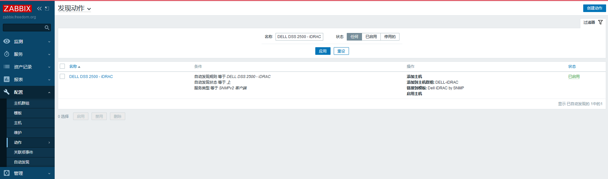
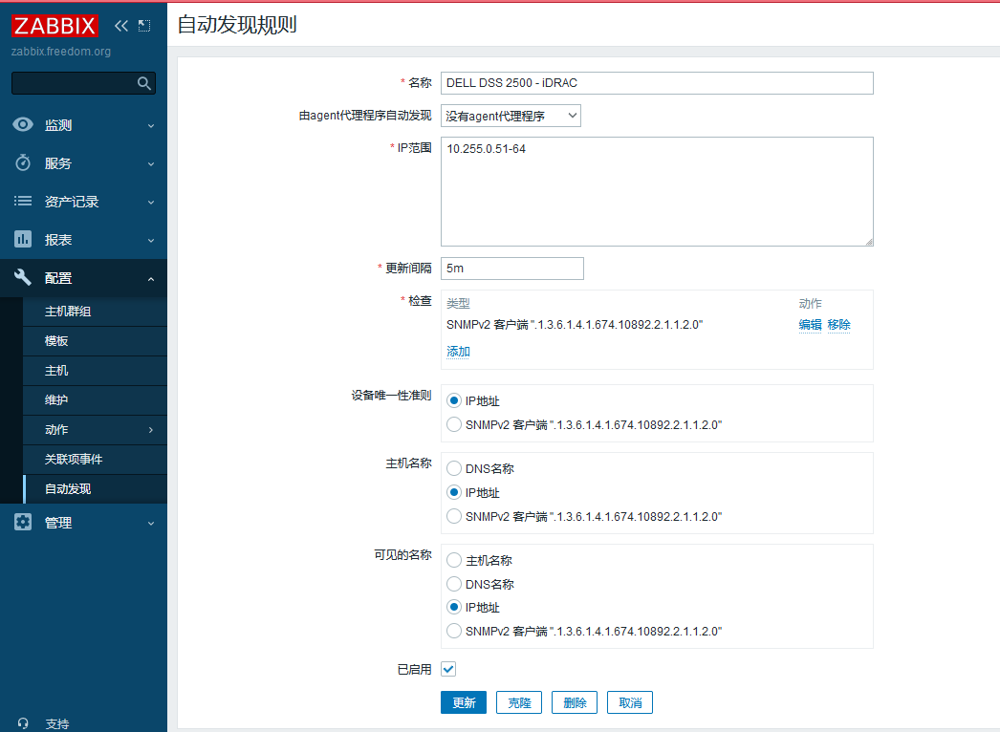
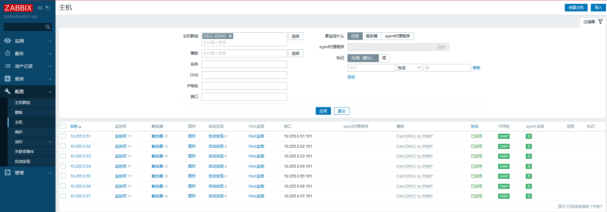

# 99-杂记--006-zabbix监控dell物理服务器.md

## 说明
- 监控物理机，当前使用snmp协议完成，访问其iDRAC地址，因为物理机装什么操作系统是不确定的。
- 监控的对象有多台，需要使用`自动发现`和`发现动作`完成。
- `自动发现`创建规则时，检查类型要选`SNMPV2客户端`，团体名为`public`（默认值），其`SNMP OID`的值要为`.1.3.6.1.4.1.674.10892.2.1.1.2.0`。
  ```shell
  [root@wang-hao-hao-01.indv.freedom.org ~ 17:15]# 5> snmpget -v 2c -c public 10.255.0.51 .1.3.6.1.4.1.674.10892.2.1.1.2.0
  SNMPv2-SMI::enterprises.674.10892.2.1.1.2.0 = STRING: "iDRAC8"
  [root@wang-hao-hao-01.indv.freedom.org ~ 17:16]# 6> 
  ```

## 配置过程








