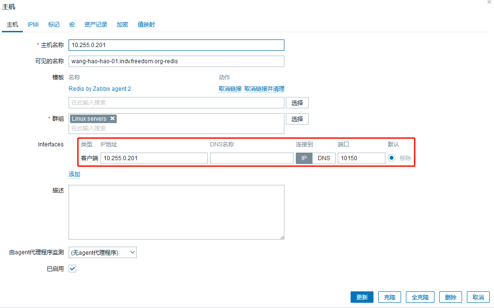
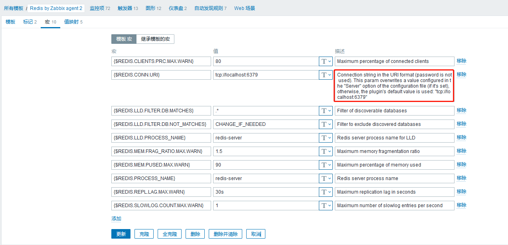

# 99-杂记--010-zabbix监控redis.md

## 说明
- zabbix新版本支持模板挺丰富的，此时使用官方模板`Redis by Zabbix agent 2`即可。

- 官方文档：https://www.zabbix.com/cn/integrations/redis

- **文档中记录的密码使用mkpasswd生成随机密码，此外，此密码仅用于个人实验环境。**

## 配置过程
- 监控主机上要安装`zabbix-agent2`软件包，`zabbix-agent`和`zabbix-agent2`可以共存在一台主机上，需要配置不同的监听端口，其他配置项根据实际情况修改。

- `zabbix-agent2`在当前环境下使用的是`10150`端口。

- 由于`zabbix-agent2`没有使用默认端口`10050`，所以监控redis时，需要单独创建一台主机，客户端监听的端口要改为`10150`。
  

## redis配置密码说明
- 模板中默认没有配置密码，说明如下。
  

- 当redis配置了密码认证后，需要修改`/etc/zabbix/zabbix_agent2.d/plugins.d/redis.conf`文件，配置`Plugins.Redis.Default.Password`即可。

## 单主机多redis实例情况
