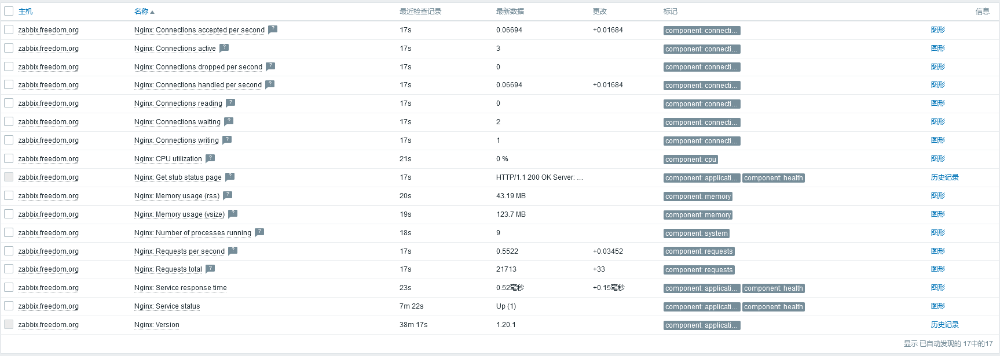

# 99-杂记--012-zabbix监控nginx.md


## 说明
- 使用官方模板`Nginx by Zabbix agent`即可。

- 官方文档：https://www.zabbix.com/integrations/nginx#nginx_agent

- **文档中记录的密码使用mkpasswd生成随机密码，此外，此密码仅用于个人实验环境。**


## 配置说明
- 检查nginx安装时启用了http_stub_status_module，命令为：`nginx -V 2>&1 | grep -o with-http_stub_status_module`。

- nginx配置安装时启用了80，如果是一些特殊的情况下没有，那么自行配置个server配置块即可。默认80端口的location配置文件位于`include /etc/nginx/default.d/*.conf;`
  ```shell
  # cat /etc/nginx/default.d/status.conf 
  location = /basic_status {
      stub_status;
      allow 127.0.0.1;
      allow ::1;
      deny all;
  }
  ```


## 监控结果
