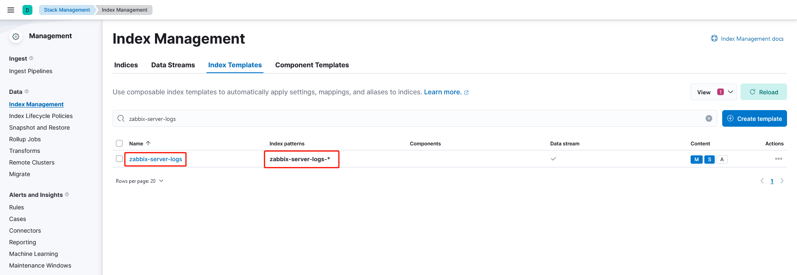
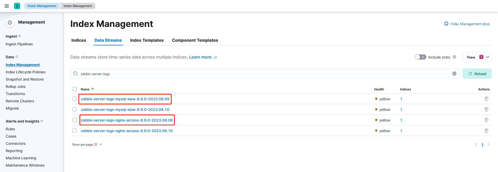

# 使用filebeat收集日志（module）


## 说明
- elastic版本为`8.9.0`。

- 以收集zabbix服务器的nginx和mysql日志为例，针对不同的日志创建不同的index，并且使用filebeat的module来解析日志文件。

- 官方文档：
  - https://www.elastic.co/guide/en/beats/filebeat/8.9/configuring-howto-filebeat.html
  - https://www.elastic.co/guide/en/beats/filebeat/8.9/configuration-filebeat-modules.html
  - https://www.elastic.co/guide/en/beats/filebeat/8.9/filebeat-module-nginx.html
  - https://www.elastic.co/guide/en/beats/filebeat/8.9/filebeat-module-mysql.html

- **文档中记录的密码使用mkpasswd生成随机密码，此外，此密码仅用于个人实验环境。**


## 配置文件
- 配置文件内容如下。
  ```shell
  # 使用官方自带的模块解析日志，将模块内容直接写入配置文件中，而不用以下方式，主要是方便部署，结构化清楚。
  ########################################
  # filebeat.config:
  # modules:
  #   enabled: true
  #   path: modules.d/*.yml
  ########################################
  filebeat:
    modules:
      - module: nginx
        access:
          enabled: true
          var.paths:
            - /var/log/nginx/access.log*
        error:
          enabled: true
          var.paths:
            - /var/log/nginx/error.log*
      - module: mysql
        error:
          enabled: true
          var.paths:
            - /var/log/mysql/mysqld.log
        slowlog:
          enabled: true
          var.paths:
            - /var/log/mysql/slow.log

  # 设置模板名称，默认模板名称为filebeat-%{[agent.version]}
  setup.template.name: "zabbix-server-logs"
  setup.template.pattern: "zabbix-server-logs-*" 
  setup.template.settings:
    index.number_of_shards: 1

  # 使用kibana上管理界面方法测试数据时，需要配置kibana地址，用于生成dashboard。
  setup.kibana:
    host: "kibana.freedom.org:5601"

  # 输出到elasticsearch，这里要根据不同的日志生产不同的index，event.module/fileset.name就是模块中的属性。
  # 如果只用一个index，那么在hosts同级下定义index变量值即可。
  output.elasticsearch:
    hosts: ["http://elastic.freedom.org:9200"]
    indices:
      - index: "zabbix-server-logs-nginx-access-%{[agent.version]}-%{+yyyy.MM.dd}"
        when.equals:
            event.module: "nginx"
            fileset.name: "access"
      - index: "zabbix-server-logs-nginx-error-%{[agent.version]}-%{+yyyy.MM.dd}"
        when.equals:
            event.module: "nginx"
            fileset.name: "error"
      - index: "zabbix-server-logs-mysql-error-%{[agent.version]}-%{+yyyy.MM.dd}"
        when.equals:
            event.module: "mysql"
            fileset.name: "error"
      - index: "zabbix-server-logs-mysql-slow-%{[agent.version]}-%{+yyyy.MM.dd}"
        when.equals:
            event.module: "mysql"
            fileset.name: "slowlog"

  # 配置文件中默认选项，没有注释，所以就保留下来了。
  processors:
    - add_host_metadata:
        when.not.contains.tags: forwarded
    - add_cloud_metadata: ~
    - add_docker_metadata: ~
    - add_kubernetes_metadata: ~
  ```

## 结果
- zabbix-server索引模板。
  

- zabbix-server数据流。
  

- zabbix-server nginx日志解析。
  ```json
  {
    "_index": ".ds-zabbix-server-logs-nginx-access-8.9.0-2023.08.09-2023.08.09-000001",
    "_id": "VBig2IkBZokiYTLwrYq1",
    "_version": 1,
    "_score": 0,
    "_source": {
      "agent": {
        "name": "zabbix.freedom.org",
        "id": "e1907ed6-773b-4ac5-9ab0-71e29fbfa429",
        "type": "filebeat",
        "ephemeral_id": "278f98fd-e7a3-4827-ad18-e31ef4e8f0ed",
        "version": "8.9.0"
      },
      "nginx": {
        "access": {
          "remote_ip_list": [
            "::1"
          ]
        }
      },
      "log": {
        "file": {
          "path": "/var/log/nginx/access.log"
        },
        "offset": 589240
      },
      "source": {
        "address": "::1",
        "ip": "::1"
      },
      "fileset": {
        "name": "access"
      },
      "url": {
        "path": "/basic_status",
        "original": "/basic_status"
      },
      "input": {
        "type": "log"
      },
      "@timestamp": "2023-08-09T04:49:14.000Z",
      "ecs": {
        "version": "1.12.0"
      },
      "_tmp": {},
      "related": {
        "ip": [
          "::1"
        ]
      },
      "service": {
        "type": "nginx"
      },
      "host": {
        "hostname": "zabbix.freedom.org",
        "os": {
          "kernel": "5.14.0-284.11.1.el9_2.x86_64",
          "codename": "Blue Onyx",
          "name": "Rocky Linux",
          "type": "linux",
          "family": "redhat",
          "version": "9.2 (Blue Onyx)",
          "platform": "rocky"
        },
        "containerized": false,
        "ip": [
          "10.255.0.246",
          "fe80::250:56ff:fe9d:1063"
        ],
        "name": "zabbix.freedom.org",
        "id": "8a9b42ca35e242058e5e9bb5aca825ba",
        "mac": [
          "00-50-56-9D-10-63"
        ],
        "architecture": "x86_64"
      },
      "http": {
        "request": {
          "method": "GET"
        },
        "response": {
          "status_code": 200,
          "body": {
            "bytes": 109
          }
        },
        "version": "1.1"
      },
      "event": {
        "ingested": "2023-08-09T04:49:16.212995491Z",
        "original": "::1 - - [09/Aug/2023:12:49:14 +0800] \"GET /basic_status HTTP/1.1\" 200 109 \"-\" \"Zabbix 6.0.17\" \"-\"",
        "timezone": "+08:00",
        "created": "2023-08-09T04:49:15.222Z",
        "kind": "event",
        "module": "nginx",
        "category": [
          "web"
        ],
        "type": [
          "access"
        ],
        "dataset": "nginx.access",
        "outcome": "success"
      },
      "user_agent": {
        "original": "Zabbix 6.0.17",
        "name": "Other",
        "device": {
          "name": "Other"
        }
      }
    },
    "fields": {
      "event.category": [
        "web"
      ],
      "host.os.name.text": [
        "Rocky Linux"
      ],
      "user_agent.original.text": [
        "Zabbix 6.0.17"
      ],
      "url.original.text": [
        "/basic_status"
      ],
      "host.hostname": [
        "zabbix.freedom.org"
      ],
      "host.mac": [
        "00-50-56-9D-10-63"
      ],
      "traefik.access.user_agent.name": [
        "Other"
      ],
      "service.type": [
        "nginx"
      ],
      "http.request.method": [
        "GET"
      ],
      "host.os.version": [
        "9.2 (Blue Onyx)"
      ],
      "traefik.access.user_agent.original": [
        "Zabbix 6.0.17"
      ],
      "host.os.name": [
        "Rocky Linux"
      ],
      "source.ip": [
        "::1"
      ],
      "agent.name": [
        "zabbix.freedom.org"
      ],
      "host.name": [
        "zabbix.freedom.org"
      ],
      "http.response.status_code": [
        200
      ],
      "event.kind": [
        "event"
      ],
      "http.version": [
        "1.1"
      ],
      "event.outcome": [
        "success"
      ],
      "user_agent.original": [
        "Zabbix 6.0.17"
      ],
      "event.original": [
        "::1 - - [09/Aug/2023:12:49:14 +0800] \"GET /basic_status HTTP/1.1\" 200 109 \"-\" \"Zabbix 6.0.17\" \"-\""
      ],
      "host.os.type": [
        "linux"
      ],
      "fileset.name": [
        "access"
      ],
      "input.type": [
        "log"
      ],
      "user_agent.name": [
        "Other"
      ],
      "log.offset": [
        589240
      ],
      "agent.hostname": [
        "zabbix.freedom.org"
      ],
      "host.architecture": [
        "x86_64"
      ],
      "url.path": [
        "/basic_status"
      ],
      "agent.id": [
        "e1907ed6-773b-4ac5-9ab0-71e29fbfa429"
      ],
      "host.containerized": [
        false
      ],
      "ecs.version": [
        "1.12.0"
      ],
      "event.created": [
        "2023-08-09T04:49:15.222Z"
      ],
      "agent.version": [
        "8.9.0"
      ],
      "host.os.family": [
        "redhat"
      ],
      "source.address": [
        "::1"
      ],
      "host.ip": [
        "10.255.0.246",
        "fe80::250:56ff:fe9d:1063"
      ],
      "agent.type": [
        "filebeat"
      ],
      "event.module": [
        "nginx"
      ],
      "related.ip": [
        "::1"
      ],
      "host.os.kernel": [
        "5.14.0-284.11.1.el9_2.x86_64"
      ],
      "host.id": [
        "8a9b42ca35e242058e5e9bb5aca825ba"
      ],
      "event.timezone": [
        "+08:00"
      ],
      "host.os.codename": [
        "Blue Onyx"
      ],
      "nginx.access.remote_ip_list": [
        "::1"
      ],
      "http.response.body.bytes": [
        109
      ],
      "event.ingested": [
        "2023-08-09T04:49:16.212Z"
      ],
      "url.original": [
        "/basic_status"
      ],
      "@timestamp": [
        "2023-08-09T04:49:14.000Z"
      ],
      "host.os.platform": [
        "rocky"
      ],
      "event.type": [
        "access"
      ],
      "log.file.path": [
        "/var/log/nginx/access.log"
      ],
      "agent.ephemeral_id": [
        "278f98fd-e7a3-4827-ad18-e31ef4e8f0ed"
      ],
      "user_agent.device.name": [
        "Other"
      ],
      "event.dataset": [
        "nginx.access"
      ]
    }
  }
  ```

- zabbix-server mysql慢日志解析。
  ```json
  {
    "_index": ".ds-zabbix-server-logs-mysql-slow-8.9.0-2023.08.09-2023.08.09-000001",
    "_id": "TBig2IkBZokiYTLwqYrM",
    "_version": 1,
    "_score": 0,
    "_source": {
      "agent": {
        "name": "zabbix.freedom.org",
        "id": "e1907ed6-773b-4ac5-9ab0-71e29fbfa429",
        "type": "filebeat",
        "ephemeral_id": "278f98fd-e7a3-4827-ad18-e31ef4e8f0ed",
        "version": "8.9.0"
      },
      "temp": {},
      "log": {
        "file": {
          "path": "/var/log/mysql/slow.log"
        },
        "offset": 21610006,
        "flags": [
          "multiline"
        ]
      },
      "source": {
        "domain": "localhost"
      },
      "fileset": {
        "name": "slowlog"
      },
      "input": {
        "type": "log"
      },
      "@timestamp": "2023-08-09T04:49:14.000Z",
      "ecs": {
        "version": "1.12.0"
      },
      "related": {
        "user": [
          "zabbix"
        ]
      },
      "service": {
        "type": "mysql"
      },
      "host": {
        "hostname": "zabbix.freedom.org",
        "os": {
          "kernel": "5.14.0-284.11.1.el9_2.x86_64",
          "codename": "Blue Onyx",
          "name": "Rocky Linux",
          "type": "linux",
          "family": "redhat",
          "version": "9.2 (Blue Onyx)",
          "platform": "rocky"
        },
        "ip": [
          "10.255.0.246",
          "fe80::250:56ff:fe9d:1063"
        ],
        "containerized": false,
        "name": "zabbix.freedom.org",
        "id": "8a9b42ca35e242058e5e9bb5aca825ba",
        "mac": [
          "00-50-56-9D-10-63"
        ],
        "architecture": "x86_64"
      },
      "mysql": {
        "thread_id": 5465,
        "slowlog": {
          "lock_time": {
            "sec": 0.000003
          },
          "rows_sent": 0,
          "rows_examined": 20,
          "query": "delete from history_uint where itemid=80218 and clock<1690951730;",
          "current_user": "zabbix"
        }
      },
      "event": {
        "duration": 57323000,
        "ingested": "2023-08-09T04:49:15.212002044Z",
        "kind": "event",
        "module": "mysql",
        "category": [
          "database"
        ],
        "type": [
          "info"
        ],
        "dataset": "mysql.slowlog"
      },
      "user": {
        "name": "zabbix"
      }
    },
    "fields": {
      "event.category": [
        "database"
      ],
      "host.os.name.text": [
        "Rocky Linux"
      ],
      "user.name": [
        "zabbix"
      ],
      "host.hostname": [
        "zabbix.freedom.org"
      ],
      "source.domain": [
        "localhost"
      ],
      "host.mac": [
        "00-50-56-9D-10-63"
      ],
      "service.type": [
        "mysql"
      ],
      "host.ip": [
        "10.255.0.246",
        "fe80::250:56ff:fe9d:1063"
      ],
      "agent.type": [
        "filebeat"
      ],
      "mysql.slowlog.lock_time.sec": [
        0.000003
      ],
      "event.module": [
        "mysql"
      ],
      "host.os.version": [
        "9.2 (Blue Onyx)"
      ],
      "host.os.kernel": [
        "5.14.0-284.11.1.el9_2.x86_64"
      ],
      "host.os.name": [
        "Rocky Linux"
      ],
      "agent.name": [
        "zabbix.freedom.org"
      ],
      "host.name": [
        "zabbix.freedom.org"
      ],
      "host.id": [
        "8a9b42ca35e242058e5e9bb5aca825ba"
      ],
      "event.kind": [
        "event"
      ],
      "mysql.slowlog.rows_sent": [
        0
      ],
      "mysql.slowlog.current_user": [
        "zabbix"
      ],
      "mysql.slowlog.rows_examined": [
        20
      ],
      "host.os.type": [
        "linux"
      ],
      "fileset.name": [
        "slowlog"
      ],
      "host.os.codename": [
        "Blue Onyx"
      ],
      "input.type": [
        "log"
      ],
      "log.offset": [
        21610006
      ],
      "agent.hostname": [
        "zabbix.freedom.org"
      ],
      "log.flags": [
        "multiline"
      ],
      "related.user": [
        "zabbix"
      ],
      "host.architecture": [
        "x86_64"
      ],
      "event.duration": [
        57323000
      ],
      "mysql.thread_id": [
        5465
      ],
      "event.ingested": [
        "2023-08-09T04:49:15.212Z"
      ],
      "@timestamp": [
        "2023-08-09T04:49:14.000Z"
      ],
      "agent.id": [
        "e1907ed6-773b-4ac5-9ab0-71e29fbfa429"
      ],
      "ecs.version": [
        "1.12.0"
      ],
      "host.os.platform": [
        "rocky"
      ],
      "host.containerized": [
        false
      ],
      "log.file.path": [
        "/var/log/mysql/slow.log"
      ],
      "event.type": [
        "info"
      ],
      "mysql.slowlog.query": [
        "delete from history_uint where itemid=80218 and clock<1690951730;"
      ],
      "agent.ephemeral_id": [
        "278f98fd-e7a3-4827-ad18-e31ef4e8f0ed"
      ],
      "agent.version": [
        "8.9.0"
      ],
      "host.os.family": [
        "redhat"
      ],
      "event.dataset": [
        "mysql.slowlog"
      ],
      "user.name.text": [
        "zabbix"
      ]
    }
  }
  ```