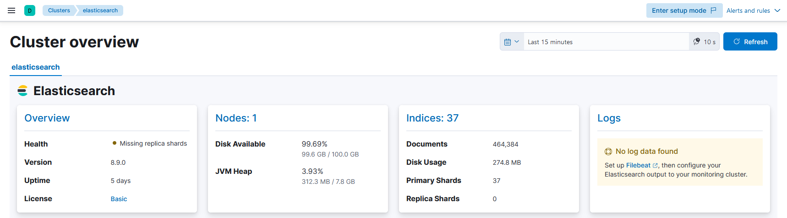

# 安装metricbeat监控集群


## 说明
- elastic版本为`8.9.0`。

- metricbeat有很多功能，但是目前只监控集群本身。

- 官方文档：
  - https://www.elastic.co/guide/en/beats/metricbeat/8.9/metricbeat-installation-configuration.html
  - https://www.elastic.co/guide/en/beats/metricbeat/8.9/metricbeat-reference-yml.html
  - https://www.elastic.co/guide/en/beats/metricbeat/8.9/configuration-metricbeat.html

- **文档中记录的密码使用mkpasswd生成随机密码，此外，此密码仅用于个人实验环境。**


## 配置文件
- 配置文件内容如下。
  ```yaml
  metricbeat:
    modules:
      - module: system
        period: 10s
        metricsets:
          - cpu
          - load
          - memory
          - network
          - process
          - process_summary
          - socket_summary
          - diskio
        process.include_top_n:
          by_cpu: 5      # include top 5 processes by CPU
          by_memory: 5   # include top 5 processes by memory
      - module: system
        period: 1m
        metricsets:
          - filesystem
          - fsstat
        processors:
        - drop_event.when.regexp:
            system.filesystem.mount_point: '^/(sys|cgroup|proc|dev|etc|host|lib|snap)($|/)'
      - module: system
        period: 15m
        metricsets:
          - uptime
      - module: elasticsearch
        xpack.enabled: true
        period: 10s
        hosts: ["http://localhost:9200"]
  
  setup.template.settings:
    index.number_of_shards: 1
    index.codec: best_compression
  
  setup.kibana:
    host: "kibana.freedom.org:5601"
  
  output.elasticsearch:
    hosts: ["http://elastic.freedom.org:9200"]
  
  processors:
    - add_host_metadata: ~
    - add_cloud_metadata: ~
    - add_docker_metadata: ~
    - add_kubernetes_metadata: ~
  ```

## 结果
