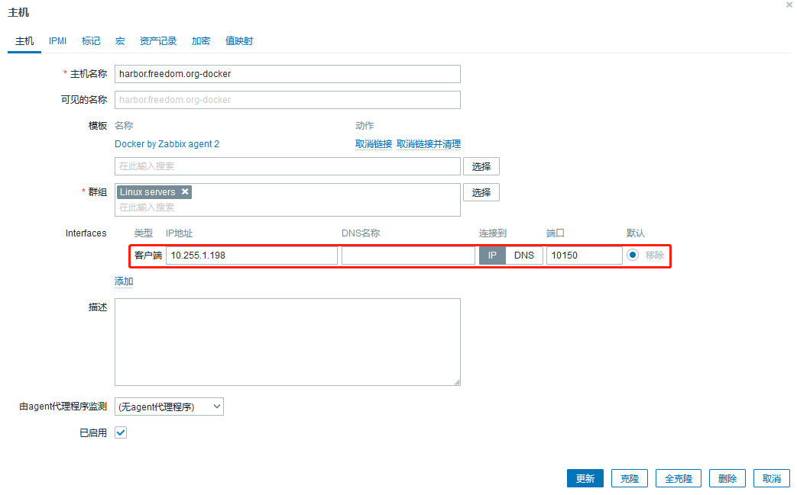
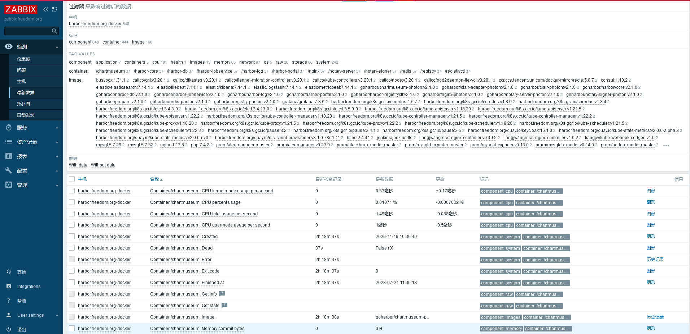

# 监控docker


## 说明
- 使用官方模板`Docker by Zabbix agent 2`即可。

- 官方文档：
  - https://www.zabbix.com/integrations/docker#docker

- **文档中记录的密码使用mkpasswd生成随机密码，此外，此密码仅用于个人实验环境。**


## 配置说明
- 此模板没有什么宏需要配置，倒是有一些权限的细节要注意。zabbix监控docker时，需要与`/var/run/docker.sock`通信，所以zabbix用户需要加权限。
  ```shell
  # ll /var/run/docker.sock
  srw-rw---- 1 root docker 0 Jul 21 15:39 /var/run/docker.sock
  # usermod -aG docker zabbix
  # usermod -aG root zabbix
  # id zabbix
  uid=997(zabbix) gid=995(zabbix) groups=995(zabbix),0(root),993(docker)
  ```
- 如果更新docker版本，碰上docker启动报错：`docker.service: Failed at step LIMITS spawning /usr/bin/dockerd: Operation not permitted`，则修改配置文件`/usr/lib/systemd/system/docker.service`以下配置项，将`infinity`指定成具体值。
  ```shell
  LimitNOFILE=20000
  LimitNPROC=20000
  LimitCORE=20000
  ```

- 监控`harbor.freedom.org`发现有两个容器不能正常运行，`clair-adapter`和`clair`，以下是chatGPT解释。
  ```
   根据镜像名称判断，这两个容器在 Harbor 中主要用于提供 vulnerability scanning 功能:
  
      goharbor/clair-adapter-photon: 这是 Harbor 的 Clair 适配器，用于和 Clair 引擎进行交互，将镜像信息发送给 Clair 进行安全扫描。
  
      goharbor/clair-photon: 这是 Clair 的核心引擎，接收适配器发送的镜像信息，并进行安全漏洞扫描。
  
  如果这两个容器挂掉，会导致 Harbor 的镜像安全扫描功能不可用。但不会影响 Harbor 的其他功能，比如镜像管理、访问控制等。
  
  总结一下:
  
      clair-adapter: Harbor 侧的适配器，和 Clair 引擎交互。
  
      clair-photon: Clair 引擎本体，负责安全扫描
  
      如果服务不可用，会影响 vulnerability scanning 功能 ，不会影响 Harbor 的其他功能(镜像管理、访问控制等)，所以在生产环境下，需要监控并保证这两个容器的状态，以免丢失安全扫描能力。如果实在不需要此功能，也可以考虑直接关闭。
  ```


## 监控结果


