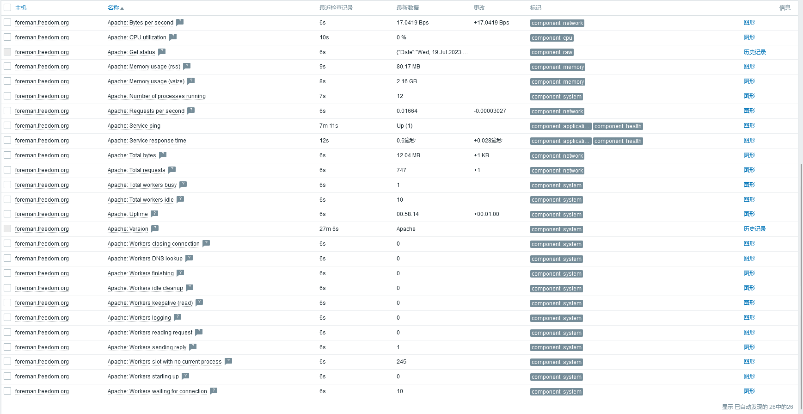

# 监控apache


## 说明
- 使用官方模板`Apache by Zabbix agent`即可。

- 官方文档：https://www.zabbix.com/integrations/apache#apache_agent

- **文档中记录的密码使用mkpasswd生成随机密码，此外，此密码仅用于个人实验环境。**


## 配置说明
- 主机默认安装httpd相关软件，没配置virtual host的情况下，在`/etc/httpd/conf.d/server-status.conf`添加子配置文件即可，示例如下：
  ```shell
  # cat /etc/httpd/conf.d/server-status.conf
  <Location /server-status>
    SetHandler server-status
  </Location>
  ```

- 主机上配置了各种virtual host或者其他复杂情况下，那么单独增加一个virtual host子配置文件，示例如下：
  ```shell
  # cat /etc/httpd/conf.d/99-server-status.conf 
  <VirtualHost *:80>
    ServerName foreman-http-status.freedom.org
  
    LoadModule status_module modules/mod_status.so
  
    <Location /server-status>
      SetHandler server-status
    </Location>
  
    AddDefaultCharset UTF-8
  </VirtualHost>
  ```


## 宏配置说明
- 主机默认安装httpd相关软件，没配置virtual host的情况下，直接使用模板即可。

- 主机上配置了各种virtual host或者其他复杂情况下，那么单独增加一个virtaul host子配置文件情况下，即要指定`{$APACHE.STATUS.HOST}`值，此例中即可`foreman-http-status.freedom.org`。


## 监控结果
