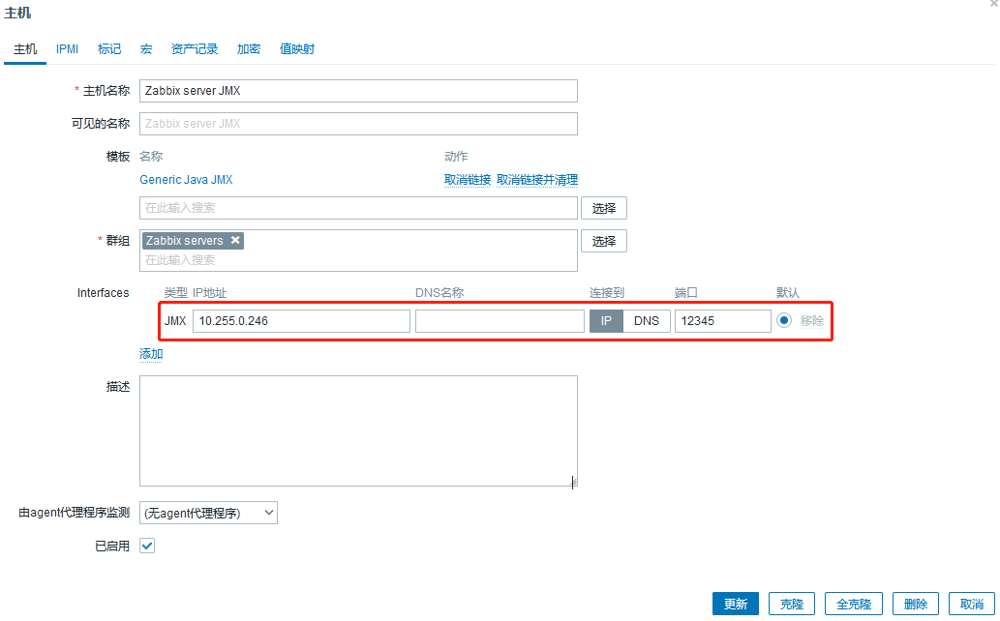
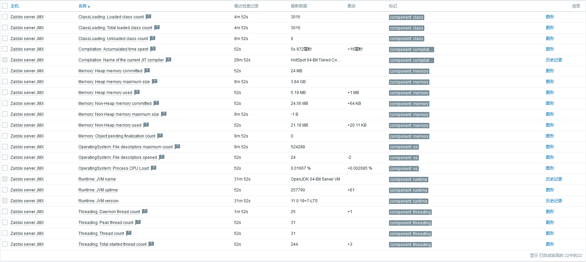

# 监控jmx


## 说明
- 使用官方模板`Generic Java JMX`即可。

- 官方文档：
  - https://www.zabbix.com/integrations/java_monitoring#generic_java_jmx
  - https://www.zabbix.com/documentation/6.0/en/manual/config/items/itemtypes/jmx_monitoring

- **文档中记录的密码使用mkpasswd生成随机密码，此外，此密码仅用于个人实验环境。**


## 配置说明
- zabbix server主机上安装zabbix-java-gateway软件包，修改配置文件`/etc/zabbix/zabbix_java_gateway.conf`开启自身jmx监控参数，其他不变。
    ```shell
    JAVA_OPTIONS="$JAVA_OPTIONS -Dcom.sun.management.jmxremote -Dcom.sun.management.jmxremote.port=12345
            -Dcom.sun.management.jmxremote.authenticate=false -Dcom.sun.management.jmxremote.ssl=false
            -Dcom.sun.management.jmxremote.registry.ssl=false"
    ```

- 如果zabbix-java-gateway没在zabbix server安装，那么zabbix server的配置文件`/etc/zabbix/zabbix_server.conf`需要修改如下参数。
    ```shell
    JavaGateway=xxx.xxx.xxx.xxx
    JavaGatewayPort=10052
    StartJavaPollers=5
    ```

- zabbix server主机配置jmx监控。
    

## 监控结果
