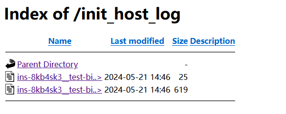
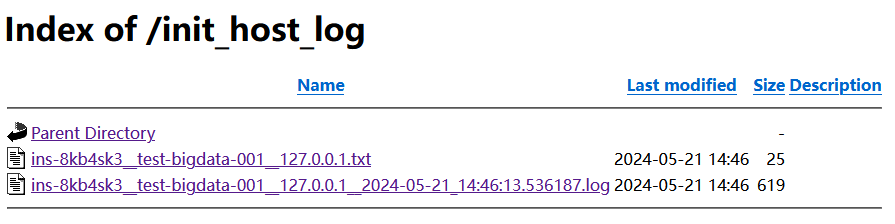

# 99-杂记-httpd-2.4优化目录显示

## 参考资料
- https://blog.csdn.net/Rookie_Manito/article/details/112967904
- https://httpd.apache.org/docs/2.4/mod/mod_autoindex.html#indexoptions

## /etc/httpd/conf/httpd.conf，配置片断
```shell
# Further relax access to the default document root:
<Directory "/var/www/html">
    #
    # Possible values for the Options directive are "None", "All",
    # or any combination of:
    #   Indexes Includes FollowSymLinks SymLinksifOwnerMatch ExecCGI MultiViews
    #
    # Note that "MultiViews" must be named *explicitly* --- "Options All"
    # doesn't give it to you.
    #
    # The Options directive is both complicated and important.  Please see
    # http://httpd.apache.org/docs/2.4/mod/core.html#options
    # for more information.
    #
    Options Indexes FollowSymLinks
    #
    # AllowOverride controls what directives may be placed in .htaccess files.
    # It can be "All", "None", or any combination of the keywords:
    #   Options FileInfo AuthConfig Limit
    #
    AllowOverride None

    #
    # Controls who can get stuff from this server.
    #
    Require all granted

    IndexOptions Charset=UTF-8
    IndexOptions NameWidth=128
</Directory>
```

## 优化前显示


## 优化后显示
