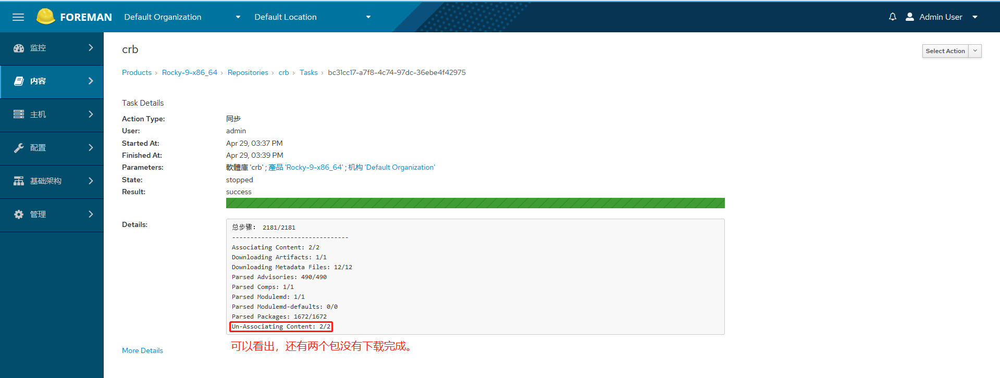

# foreman服务器的一点思考

## 思考点一：foreman是否需要部署自动化安装操作系统？
解答：**先说观点，在vmware虚拟化平台下，不需要部署自动化安装操作系统。**   
有以下几论点支撑观点：
- 安装复杂，如果安装过程中出错，排查起来也复杂。常规安装步骤如下：
  - https://www.theforeman.org/manuals/3.10/quickstart_guide.html
  - https://theforeman.org/plugins/foreman_discovery/18.0/index.html
  - 就以上这两个步骤，就需要时间研究，除去上面的，还需要额外配置dhcp和tftp，此外，还需要先在虚拟环境下配置dns服务器，并且还要用以下命令来安装相对应的插件。
    ```shell
    foreman-installer --scenario katello \
    --enable-foreman-plugin-discovery \
    --enable-foreman-plugin-ansible \
    --enable-foreman-proxy-plugin-ansible \
    --enable-foreman-plugin-remote-execution \
    --foreman-proxy-dhcp true \
    --foreman-proxy-dhcp-managed true \
    --foreman-proxy-dhcp-interface ens192 \
    --foreman-proxy-dhcp-range "192.168.2.100 192.168.2.200" \
    --foreman-proxy-dhcp-gateway 10.255.2.254 \
    --foreman-proxy-dhcp-nameservers 192.168.2.250,192.168.2.251 \
    --foreman-proxy-tftp true \
    --foreman-proxy-tftp-managed true \
    --foreman-proxy-http true
    ```
    
- 部署一个可用于自动化安装操作系统的步骤也复杂，需要配置安装介质，子网，域，主机组，分区表，PXE模板，置备表等等，这过于繁琐，此外，为了使用主机在部署过程中指定网卡地址，还要了解ERB语法，然后做各种尝试，以下的配置网卡为命令，我已记不清是从哪里copy的，最有力的线索是官方的模板内容，从中学习理解。这无疑对初学者来说，难度不小。
    ```shell
    <% subnet = @host.subnet -%>
    <% dhcp = @static -%>
    network --bootproto <%= dhcp ? 'dhcp' : "static --ip=#{@host.ip} --netmask=#{subnet.mask} --gateway=#{subnet.gateway} --nameserver=#{[subnet.dns_primary, subnet.dns_secondary].select{ |item| item.present? }.join(',')}" %> --hostname <%= @host %>
    ```
  
- **安装操作系统太慢了，相比直接使用镜像部署来说。** 翻过了以上的两座大山，结果发现效率也没有那么高，这个才是最大的决定因素。

- 【待验证】虚拟机不再使用自动发现安装操作系统，转用模板部署，虚拟机订阅yum源后，实现了主机注册，之后要验证一点就是，客户端不管是ansible还是puppet的facts信息要实时同步，如ip地址修改后，需要同步到foreman的管理界面。
  - 【ansible已验证】主机修改了ip地址后，管理员需要在foreman管理端去修改主机的ip地址，然后再执行一次ansible任务，这样就能更新页面上显示的ip地址了。
    ```shell
    [root@foreman.freedom.org /etc/foreman/plugins 10:16]# 8> cat foreman_column_view.yaml
    :column_view:
      :ipaddress:
        :title: IP
        :after: name
        :content: facts_hash['ansible_all_ipv4_addresses']
    [root@foreman.freedom.org /etc/foreman/plugins 10:16]# 9> 
    ```
  - 【puppet未验证】执行puppet后无puppet相关信息上报，还需要再学习puppet如何管理，并且要能上报状态信息。

- 【综上所述】，为了实现一个"干净的"操作系统所要的时间成本过多，最多也就是实现了配置静态ip地址而已，此外，foreman的主机管理页面功能太弱了，ip地址都不能显示出来，虽然有对应的插件，但是目前此插件已EOL（End of Life），各种自动化运维工具都需要测试验证所需要的显示，显然这不现实，现阶段都逐渐采用文本来控制发版，数据要上报则可以使用consul这样的工具再结合ansible工具来实现自动化部署。

## 思考点二：foreman不提供自动化安装操作系统后，那么foreman还能提供什么样的服务呢？
解答：提供yum源服务，类似于红帽的卫星服务，这个对于没有购买红帽服务的来说，算是最好的平替。

## 思考点三：foreman除去自动化安装操作系统外，其自动化管理（ansible/puppet）都需要深度和foreman结合使用，那么foreman自动化管理工具对自动化运维有哪些启示？
解答：首先，foreman自动化安装操作系统的逻辑是套标准流程，这就符合自动化最核心的要求，那就是标准化。主要是在虚拟机平台下来安装一台系统，要的时间太多了，如果使用模板来部署操作系统那就需要自己完成foreman上实现的自动化功能了，环境不同，需求也是多变的，更倾向自己写脚本来完成。  
其次，foreman管理平台上有`初始化配置`，copy对应的命令就可以完成注册，这一点就很友好，所以自动化配置时基础环境时，这可以用这个来实施，很多定制化的功能就可以完成。  
最后，在一次次质疑foreman功能不完善的情况下，逐渐发现很多功能是自己没使用对，或者想法需要改变，不排除后续再次使用自动化安装操作系统，毕竟有些功能需要自己写脚本来替代foreman的工作量。

## 思考点四：如何快速foreman同步上游yum源。
解答：创建好同步yum源后，使用`Immediate`下载策略后，遇到比较大的源下载经常失败，比如说crb源；如果使用`On Demand`策略时，客户端第一次下载包慢，之后再次下载时就用foreman本地文件，这样很快，但是这样的本地yum源是不完整的，所以要分析同步失败的原因（本质上来说，就是下载包不稳定），那么就能找到应对的方法了。其实解决方法也很简单，就是先把同步源的策略改成`On Demand`，然后客户端再使用`reposync --repo reposync --repo Default_Organization_Rocky-9-x86_64_crb`将包全部下载下来，因为使用这个命令下载包的成功率远比foreman页面同步操作高得多，随后同步完成后，再把策略改成`Immediate`，后续同步的数据量小，那么成功率就很高了。以下是测试结果。
 