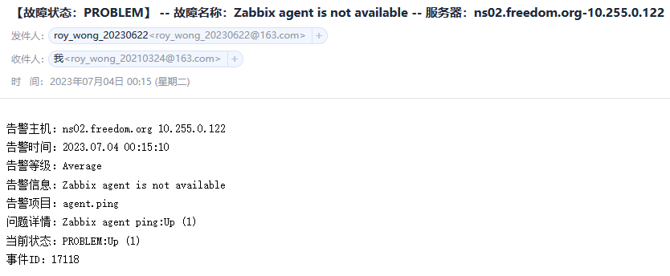

# 主动模式下zabbix-agent存活超时告警

## 更新记录
- 存活阀值调成1m过低了，会导致误报，因为取数据的周期就是一分钟，zabbix无法比对之前的数据。
  

## 说明
- zabbix-6.0-lts版本下，此模板"Linux by Zabbix agent active"中有个监控agent是否存活的触发器（Zabbix agent is not available），其检查周期为30m。

- 很多数据采集周期是一分钟，显然，这个存活检查时间太长了，需要调整成5分钟。

- 触发器原始值：`nodata(/Linux by Zabbix agent active/agent.ping,{$AGENT.NODATA_TIMEOUT})=1，这里面的宏{$AGENT.NODATA_TIMEOUT}`。

- 触发器调整后的值：`nodata(/Linux by Zabbix agent active/agent.ping,5m)=1`。

