# 配置邮件告警


## 参考文档
- https://jingyan.baidu.com/article/77b8dc7fffb07d2075eab62b.html
- https://blog.csdn.net/weixin_30852419/article/details/95364044
- https://www.cnblogs.com/qinxu/p/9838778.html
- https://www.cnblogs.com/5444de/p/13158484.html


## zabbix自带邮件告警
- 在zabbix-5.0-lts中，可以直接在告警媒介中配置即可，密码使用`邮箱授权码`即可，以163邮箱为例，其方法：https://consumer.huawei.com/cn/support/content/zh-cn15872099/。

- mail告警媒介。

  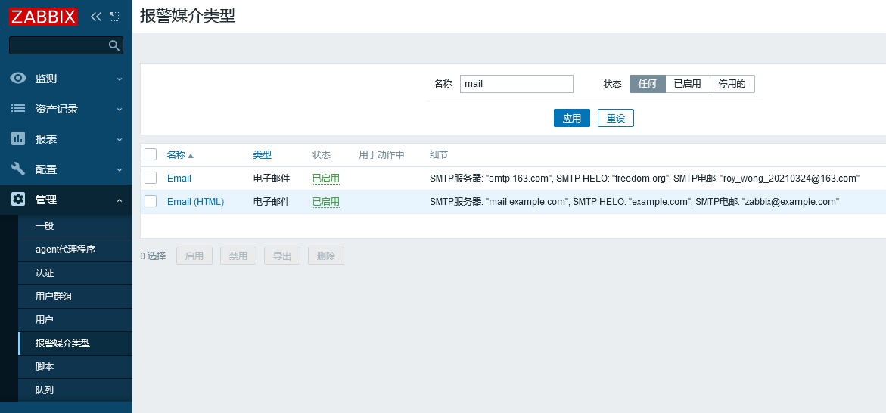
  
- mail告警配置细节。

  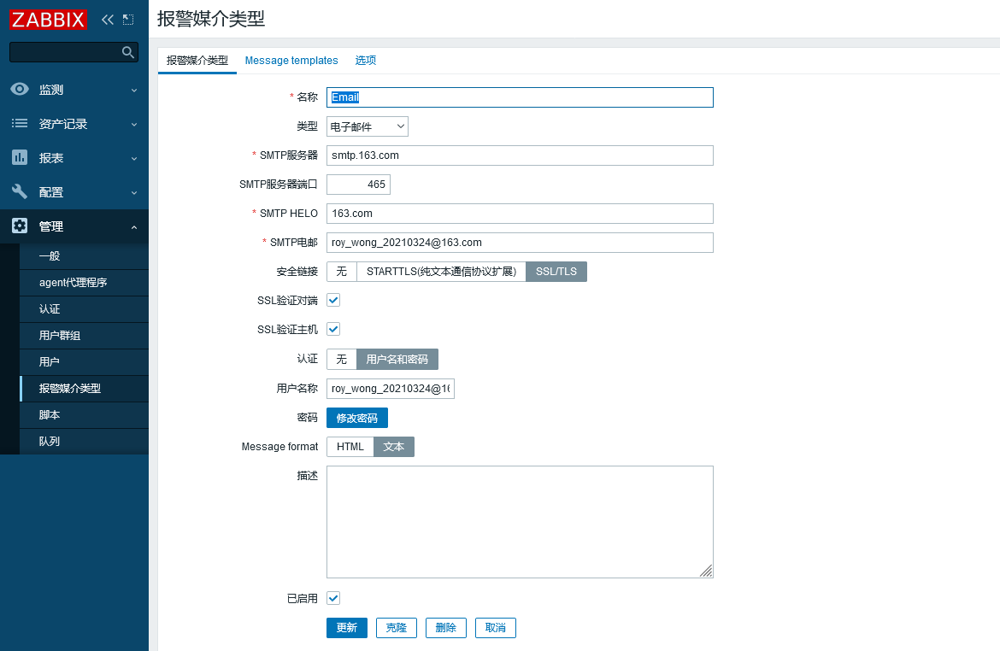


## 配置Admin用户告警媒介
- 配置Admin用户告警媒介步骤一。

  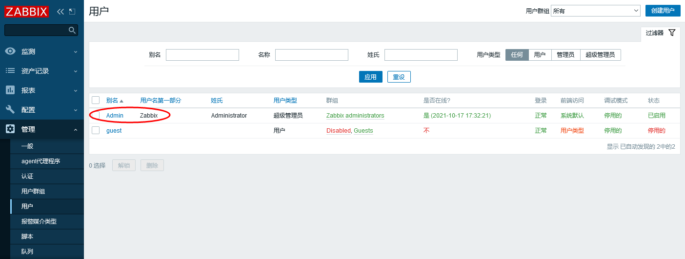
  
- 配置Admin用户告警媒介步骤二。

  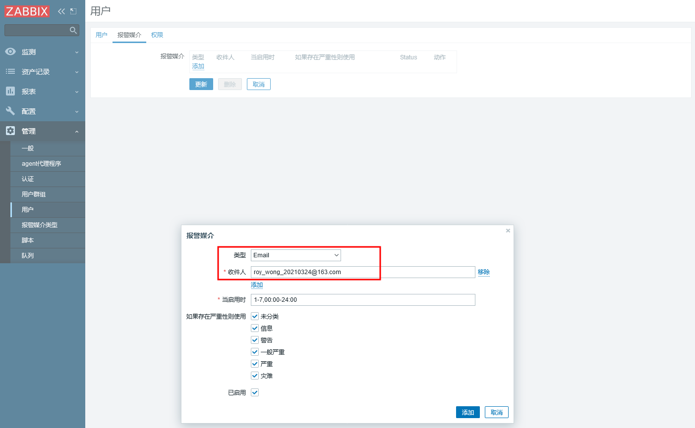
  
- 配置Admin用户告警媒介步骤三。

  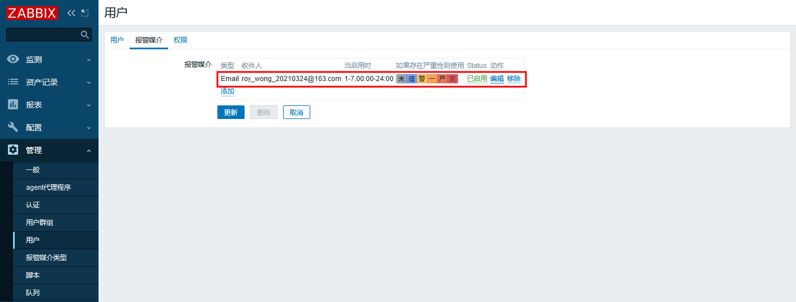


## 配置动作
- 配置动作

  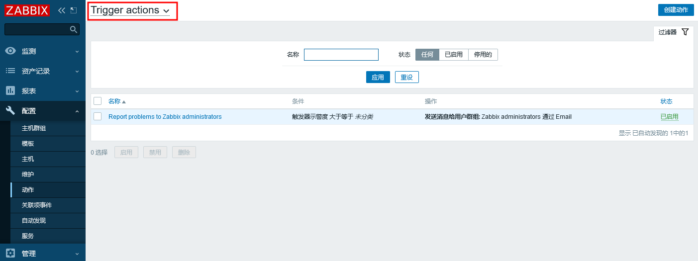
  
  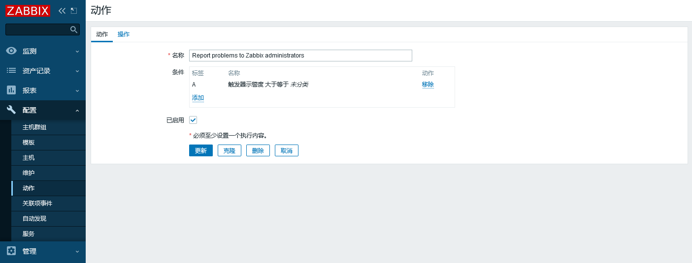
  
  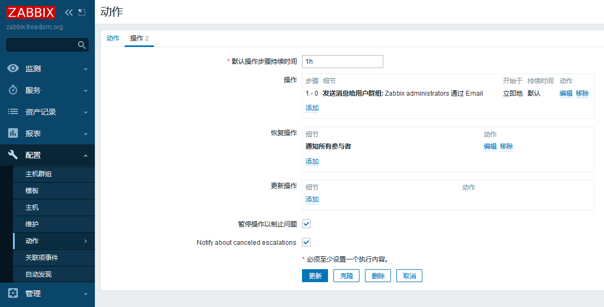
  
  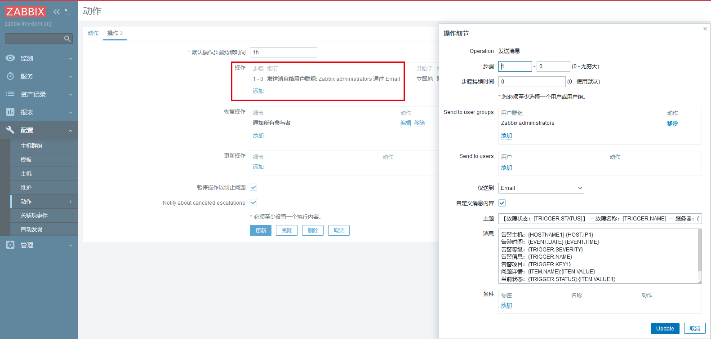
  
  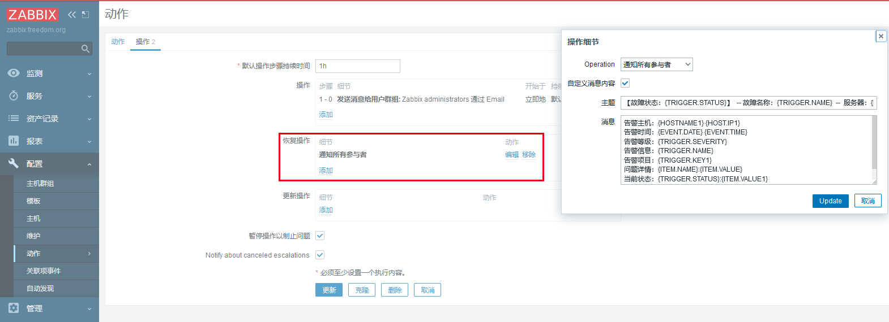

- 故障发生主题：
  ```
  【故障状态：{TRIGGER.STATUS}】  -- 故障名称：{TRIGGER.NAME}  --  服务器：{HOSTNAME1}-{HOST.IP1}
  ```
- 故障恢复主题：
  ```
  【故障状态：{TRIGGER.STATUS}】  -- 故障名称：{TRIGGER.NAME}  --  服务器：{HOSTNAME1}-{HOST.IP1}
  ```
- 故障发生/恢复内容：
  ```
  告警主机：{HOSTNAME1} {HOST.IP1}
  告警时间：{EVENT.DATE} {EVENT.TIME}
  告警等级：{TRIGGER.SEVERITY}
  告警信息：{TRIGGER.NAME}
  告警项目：{TRIGGER.KEY1}
  问题详情：{ITEM.NAME}:{ITEM.VALUE}
  当前状态：{TRIGGER.STATUS}:{ITEM.VALUE1}
  事件ID：{EVENT.ID}
  ```

## 告警测试结果
- 告警结果。

  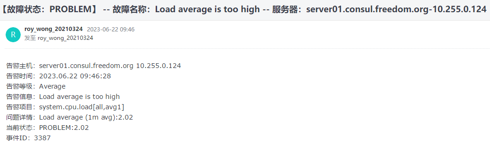
  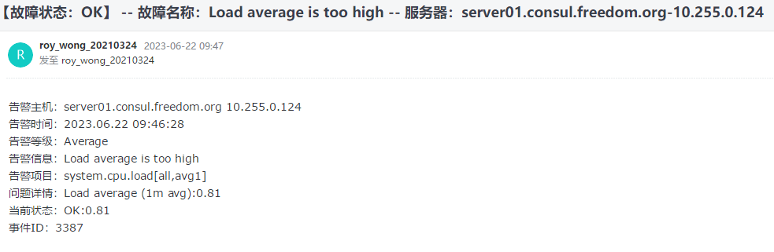