# 配置脚本告警

## 说明
- 在工作中使用zabbix做监控，其告警信息越来越多，由一个告警工具实现会让运维人员应接不暇，所以需要针对特定的告警配置不同的告警工具。

- 当前以企业微信机器人来实现脚本告警。

## 测试结果
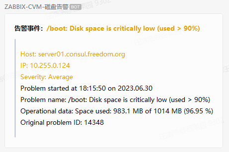

## 配置过程（zabbix-server端）
- 默认脚本位置：/usr/lib/zabbix/alertscripts，脚本名称：DevOps-Disk-QYWX-Robot.py，脚本需要有执行权限，其中QYWX_ROBOT变量值为官方示例值，实际在使用时请自行修改。
  ```python
  #!/usr/bin/python
  
  import sys
  import json
  import requests
  
  
  QYWX_ROBOT = "https://qyapi.weixin.qq.com/cgi-bin/webhook/send?key=693a91f6-7xxx-4bc4-97a0-0ec2sifa5aaa"
  
  subject = sys.argv[1]
  message = sys.argv[2]
  
  zabbix_alert_message = {}
  zabbix_alert_message["msgtype"] = "markdown"
  zabbix_alert_message["markdown"] = {}
  zabbix_alert_message["markdown"]["content"] = subject + "\n" + message
  
  headers = {}
  headers["Content-Type"] = "application/json"
  
  r = requests.post(QYWX_ROBOT, data=json.dumps(zabbix_alert_message), headers=headers)
  
  # Debug:
  # print(r.status_code)
  # print(r.text)
  ```

- 当前需要针对linux系统磁盘使用率过高进行告警，所以需要先到到触发器的名称。当前我使用的是"Linux by Zabbix agent active"，在此模板中的自动发现规则中找到"Mounted filesystem discovery"，查看其触发器类型，默认的名称如下：
    - {#FSNAME}: Disk space is critically low
    - {#FSNAME}: Disk space is low
    - {#FSNAME}: Running out of free inodes


- 配置触发器动作：DevOps-Disk-QYWX-Robot.py，在配置条件时，类型要为"触发器名称"，操作者为""包含"，值就要根据上述实际情况写，并且要去掉宏配置。
  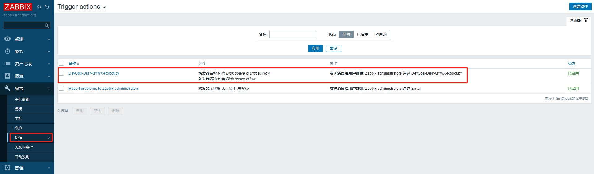

  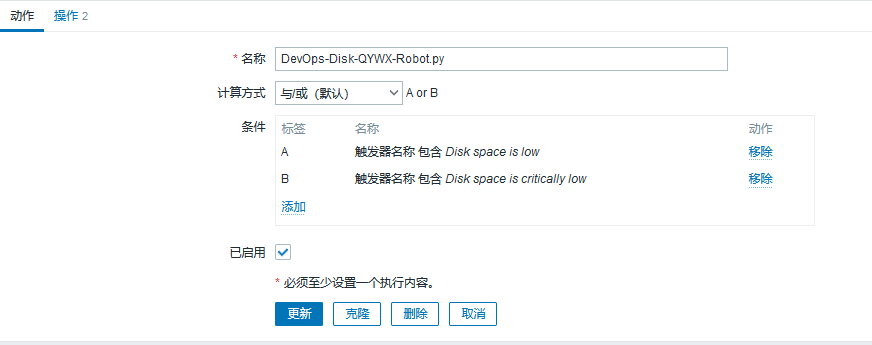

  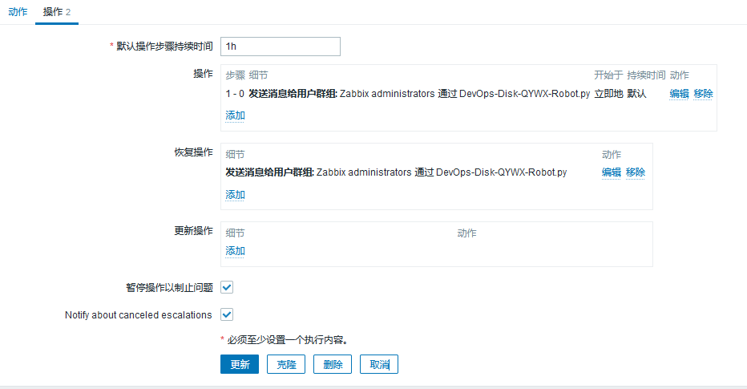


- 配置告警媒介：DevOps-Disk-QYWX-Robot.py，其中脚本参数需要配置两个宏参数：{ALERT.SUBJECT}和{ALERT.MESSAGE}，这两个值分别对应message templates中的定义的message type。
  当前使用企业微信机器人告警，发送内容格式为markdown，所以主题和消息就写成其格式，这样脚本处理起来就很方便。其主题和消息分别如下：
  - 主题：
    ```shell
    **告警事件：<font color=warning>{EVENT.NAME}</font>**
    ```
  - 消息：
    ```shell
    >
    ><font color=warning>Host: {HOST.NAME}</font>
    ><font color=warning>IP: {HOST.IP}</font>
    ><font color=warning>Severity: {EVENT.SEVERITY}</font>
    >Problem started at {EVENT.TIME} on {EVENT.DATE}
    >Problem name: {EVENT.NAME}
    >Operational data: {EVENT.OPDATA}
    >Original problem ID: {EVENT.ID}
    >
    ```
  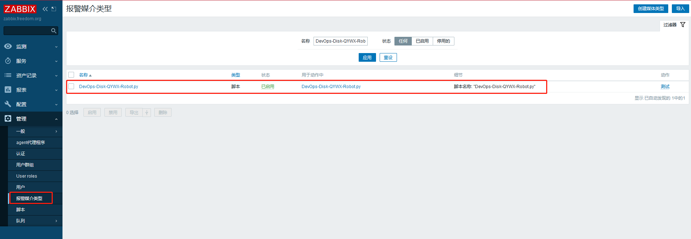

  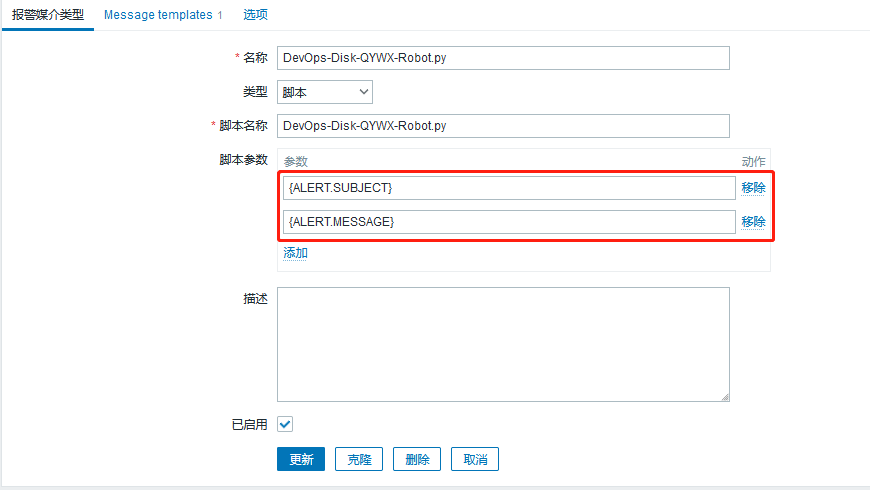

  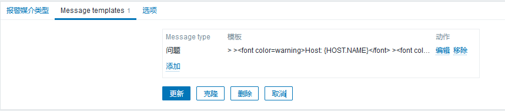

  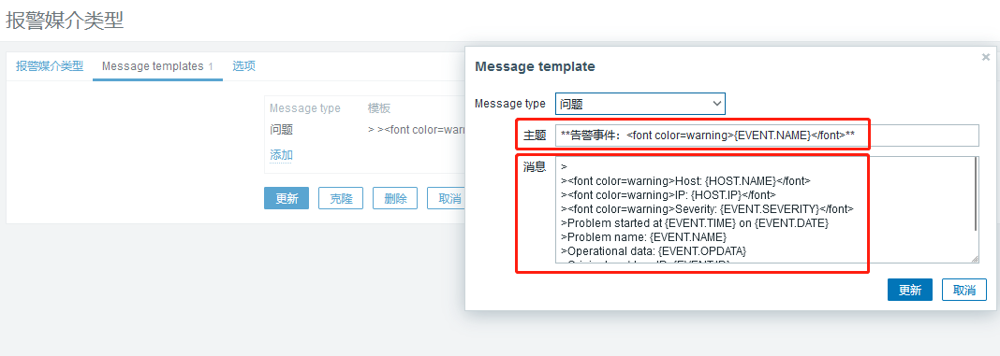

- admin用户启用告警媒介：DevOps-Disk-QYWX-Robot.py
  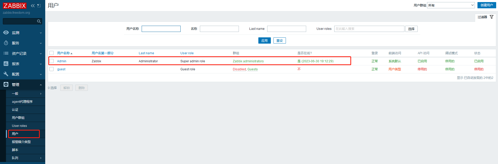
  
  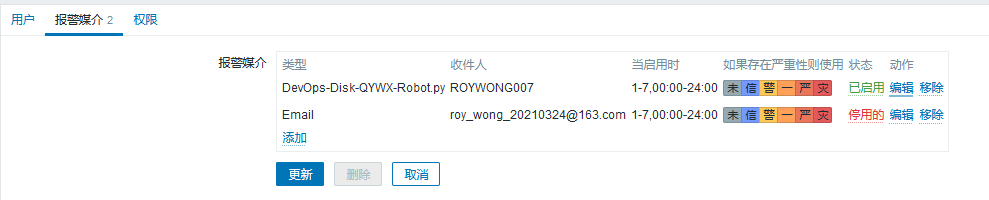

  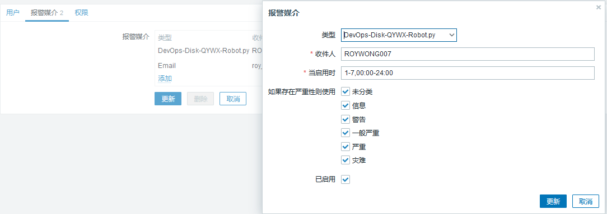